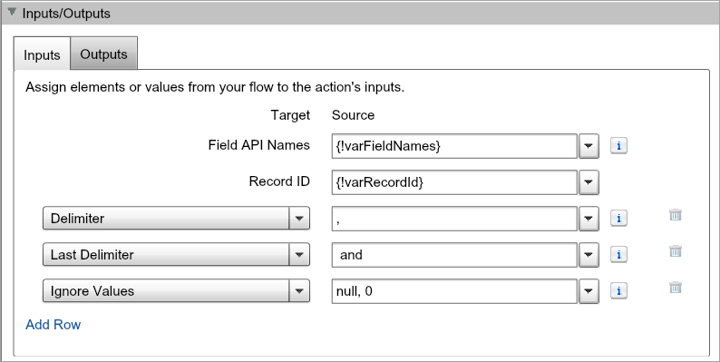
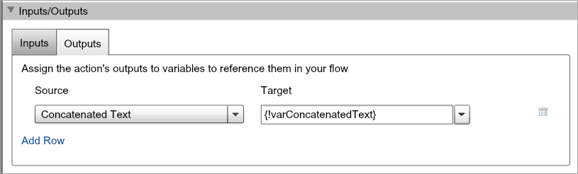

# Concatenate SObject Field Value-Label Pairs

Sample app that uses Process Builder, Flow, and Invocable Apex to concatenate multiple field value-label pairs together into a single text value.

Inspired by [Jessica Pasley](https://twitter.com/JessicaPasley/status/934885281370656768) who asked on Twitter how to take multiple fields on a record and combine them such that they displayed a grammatical sentence so that the resulting text can be used in merge templates.

For example:
> Given fields with values: shoes (4 entered), hats (3 entered), socks (0 entered). The resulting concatenated text should read "4 shoes and 3 hats".

> Given fields with values: hats (4 entered), shoes (2 entered), scarves (7 entered), coats (2 entered). The resulting concatenated text should read "4 hats, 2 shoes, 7 scarves and 2 coats".

The Challenge
-------------

It's relatively simple to combine field values together with a common delimiter, but the challenge gets much harder when needing to use multiple delimiters and it's variable when/where those delimiters will need to be used.

I had originally thought I could do this with a bunch of Decision elements in a Flow but that quickly grew out of hand, particularly when trying to build out Jessica's requirements to support 15+ fields.

The Solution
------------

My approach in the end was to develop an Invocable Apex class that could be called from Flow to obtain the concatenated text. From there Flow could do what it wanted with the text. Most common use will be to update a record or could use it in an email template.

By implementing the solution as Invocable Apex this logic can be reused in Process Builder, Flow, REST API, and Apex triggers.

Getting Started
---------------

This project comes with a sample Process Builder and Flow that show how to use the Invocable Apex class. The example runs on Account object and any time a record is edited then the automation concatenates the values in the `Site`, `AnnualRevenue`, and `NumberOfEmployees` fields into a concatenated sentence and stores the result in the `Description` field. No custom fields are used in this example to make it easier to deploy and test in both sandbox and production orgs. A test class is also included but since this is unmanaged code you may have to tweak it depending on your org's validation rules and requirements when creating accounts.

